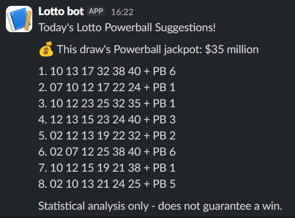
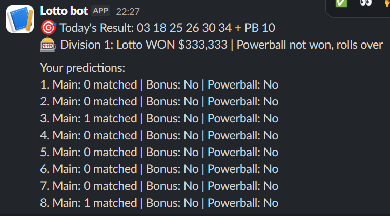

# PowerballBot

An automated NZ Lotto Powerball suggestion and results-tracking bot.

[](https://github.com/Ellywoooo/PowerballBot/actions/workflows/test.yml)
[](https://www.python.org/downloads/)

## What this project does

Twice a week (Wednesday and Saturday), the bot scores historical NZ Lotto draws, generates **8 statistically weighted number lines**, and posts them to Slack — optionally including the advertised Powerball jackpot. After the draw, it fetches the official result and dividends, compares each saved prediction line to the actual numbers, and reports matches, Lotto divisions, and prize amounts back to Slack.

**This does not predict lottery outcomes.** Draws are random and independent; no scoring method improves the real odds of winning. The project exists to practice building a real automated data pipeline: ingestion, analysis, persistence, notifications, scheduling, containerization, and tests.

**DevLog:** [Building a Data-Driven Powerball Prediction Engine with Python](https://ellys-lab.hashnode.dev/devlog-1-building-a-data-driven-powerball-prediction-engine-with-python)

---

## Example output

**Prediction** (Slack — 8 weighted lines + optional jackpot):



**Results** (Slack — actual draw vs saved predictions):



---

## Architecture / How it works

Each module does one job. `main.py` wires them together in two modes: `--mode predict` and `--mode results`.

```
predict (Wed/Sat ~afternoon NZ)
────────────────────────────────────────────────────────────
  draws_clean.csv
        │
        ▼
  predictor.py  →  score numbers → generate 8 lines
        │
        ▼
  scorer.py     →  save predictions/latest.csv  (Draw blank)
        │
        ▼
  crawler.py    →  fetch jackpot from CMS home API (optional)
        │
        ▼
  notifier.py   →  Slack: suggestions (+ jackpot if available)


results (Wed/Sat ~evening NZ)
────────────────────────────────────────────────────────────
  crawler.py    →  Lotto NZ results API → row + dividends
        │              └─ append draw to draws_clean.csv if new
        ▼
  scorer.py     →  compare latest.csv vs actual
        │              └─ fill Draw, append predictions/history.csv
        ▼
  notifier.py   →  Slack: result, Div 1 status, per-line matches/prizes
```

### `crawler.py`

- **`fetch_latest_draw()`** — GET the latest draw JSON from the Lotto NZ results API (`pathway.mylotto.co.nz`), with a polite random delay (1.5–3 s), identifiable `User-Agent`, and hard fail on HTTP 429/503 or non-200.
- **`parse_draw()`** — Maps API JSON into a CSV-shaped row (draw number, date, six mains, bonus, Powerball) plus dividend payloads (`lottoWinners` / `powerballWinners`).
- **`append_if_new()`** — Appends the row to `data/draws_clean.csv` only if that draw number is not already present.
- **`crawl()`** — Orchestrates fetch → parse → append; returns `(row, dividends)`.
- **`fetch_jackpot_from_homepage()`** — Reads the CMS home content API, finds Powerball jackpot alt text, parses a `$N million` amount. Returns `None` on any failure (never raises), so predict mode can still notify without a jackpot line.

### `predictor.py`

- **`load_draws()`** — Loads `data/draws_clean.csv`, normalizes column names, sorts by date.
- **`compute_main_scores()` / `compute_powerball_scores()`** — For each number, combines three min–max–scaled signals (weights in `config.py`):
  - **Frequency** (40%) — how often the number appears across all history (mains use columns including the bonus ball)
  - **Recency** (35%) — appearance rate over the last **52** draws
  - **Gap** (25%) — draws since the number was last seen  
  Main pool: **1–40**. Powerball pool: **1–10**.
- **`passes_filters()`** — Rejects lines that are all-odd or all-even, or that contain **4+** consecutive numbers.
- **`generate_lines()`** — Takes the top **18** main numbers by score, builds valid 6-number combinations, keeps a high-score sampling pool, then weighted-random samples **8** diverse lines (at most **2** numbers shared with any already chosen line). Powerballs are chosen randomly from the top **5** Powerball scores.

### `scorer.py`

- **`save_predictions()`** — Writes `predictions/latest.csv` after generate (Draw left blank until results).
- **`compare_prediction_to_actual()`** — Per line: main-match count, bonus match, Powerball match; if dividends are provided, maps to Lotto division 1–7 and looks up prize amount (Powerball combined prize when PB matches).
- **`archive_predictions()`** — Fills Draw on `latest.csv` and appends scored rows to `predictions/history.csv` (skips if that draw is already archived).
- **`should_skip_predict()`** — Blocks a duplicate predict run when the latest completed draw is already in history but `latest.csv` still has a pending (blank) Draw.

### `notifier.py`

- Formats and POSTs Slack webhook messages for:
  - **Predictions** — numbered lines + optional jackpot + disclaimer
  - **Results** — winning numbers, Division 1 won/not-won status, per-line match breakdown and prizes
  - **Errors** — which pipeline step failed, mode, timestamp (failures while sending the alert are printed only, never raise)

### `main.py`

| Mode | Flow |
|------|------|
| `predict` (default) | Guard skip → score → generate → save `latest.csv` → jackpot fetch → Slack |
| `results` | Crawl → compare → archive → Slack results |

Any step failure triggers `notify_error(...)` then re-raises.

### `config.py`

Tunable constants live here: CSV paths, scoring weights, `RECENT_DRAWS`, line-generation sizes, API URLs, User-Agent, and request delay bounds.

---

## Project structure

```
PowerballBot/
├── main.py                 # CLI orchestrator (--mode predict|results)
├── crawler.py              # Lotto NZ API + jackpot fetch
├── predictor.py            # Scoring + line generation
├── scorer.py               # Save / compare / archive predictions
├── notifier.py             # Slack formatting + webhooks
├── config.py               # Weights, paths, crawler settings
├── data/
│   └── draws_clean.csv     # Historical draws (~1,500+ from 2008–present)
├── predictions/
│   ├── latest.csv          # Current pending / last-scored prediction set
│   └── history.csv         # Archived predictions vs actual results
├── notebooks/
│   └── exploration.ipynb   # Formula design sandbox
├── tests/                  # pytest coverage for each module
├── Dockerfile
├── requirements.txt        # Local / CI (includes pytest, Jupyter)
├── requirements-docker.txt # Slim runtime deps for Actions / Docker
└── .github/workflows/
    ├── test.yml            # pytest on push/PR to main
    └── lotto.yml           # Scheduled predict + results runs
```

---

## Setup

**Requirements:** Python 3.13 (used in GitHub Actions and the Dockerfile), git

```powershell
git clone https://github.com/Ellywoooo/PowerballBot.git
cd PowerballBot

python -m venv venv
.\venv\Scripts\Activate.ps1

pip install -r requirements.txt
```

Create a `.env` in the project root (see `.env.example`):

```
SLACK_WEBHOOK_URL=https://hooks.slack.com/services/...
```

Never commit `.env` — it is gitignored.

---

## Running locally

```powershell
# Generate 8 lines, save predictions/latest.csv, post to Slack
python main.py --mode predict

# Fetch latest draw, score predictions, archive, post results
python main.py --mode results

# Predictor only (prints lines, no Slack / no CSV save)
python predictor.py

# Crawler only (fetch + append if new)
python crawler.py
```

---

## Scheduling (GitHub Actions)

`.github/workflows/lotto.yml` runs on Ubuntu with Python 3.13:

| Cron (UTC) | Days | Mode | Approx NZ target |
|------------|------|------|------------------|
| `0 1 * * 3,6` | Wed / Sat | `predict` | ~afternoon (fires early to absorb Actions delay) |
| `0 8 * * 3,6` | Wed / Sat | `results` | ~evening after sales close |

Manual runs are available via **workflow_dispatch** (`predict` or `results`).

After a successful run, the workflow commits updates to `data/draws_clean.csv` and `predictions/` back to `main`.

Requires repository secret: `SLACK_WEBHOOK_URL`.

---

## Configuration highlights

| Setting | Value | Meaning |
|---------|-------|---------|
| `WEIGHT_FREQ` / `RECENCY` / `GAP` | 0.40 / 0.35 / 0.25 | Scoring blend (must sum to 1.0) |
| `RECENT_DRAWS` | 52 | Window for recency rate |
| `NUM_LINES` | 8 | Lines posted each predict run |
| `CANDIDATE_POOL_SIZE` | 18 | Top mains used to build combinations |
| `MAX_SHARED` | 2 | Diversity cap between chosen lines |
| `REQUEST_DELAY_*` | 1.5–3.0 s | Polite delay before crawler requests |

---

## Tests

```powershell
pytest -v
```

Coverage includes crawler parsing/append behaviour, scoring and filters, line generation, prediction save/compare/archive (including skip guards), notifier formatting, and `main` orchestrator guards. CI runs the same suite on every push/PR to `main` via `.github/workflows/test.yml`.

---

## Tech stack

| Layer | Tool |
|-------|------|
| Language | Python 3.13 |
| Data | Pandas, NumPy |
| HTTP | Requests |
| Config / secrets | python-dotenv |
| Notifications | Slack Incoming Webhooks |
| Container | Docker (`python:3.13-slim`) |
| Automation | GitHub Actions (cron + workflow_dispatch) |
| Tests | pytest |

---

## Data

**Game:** NZ Lotto Powerball — 6 main numbers (1–40) + bonus (same pool) + Powerball (1–10).

**Store:** `data/draws_clean.csv` — cleaned historical results from 2008 through present (~1,500+ draws). Ongoing updates append only the latest draw from the public Lotto NZ results API.

| Column | Description |
|--------|-------------|
| `Draw` | Official draw ID |
| `Date` | Draw date (`YYYY-MM-DD`) |
| `Winning Number 1` … `6` | Main numbers |
| `Bonus Number` | Bonus ball (used in frequency analysis; not picked as a “main” in generated lines) |
| `Powerball` | Powerball (1–10) |

---

## Disclaimer

Lottery draws are statistically independent. Past results do not influence future draws. This repository is a **personal learning project** in data engineering, automation, and CI/CD — not financial advice and not a strategy for winning money.

---

## License

Personal learning project. No license specified yet.
